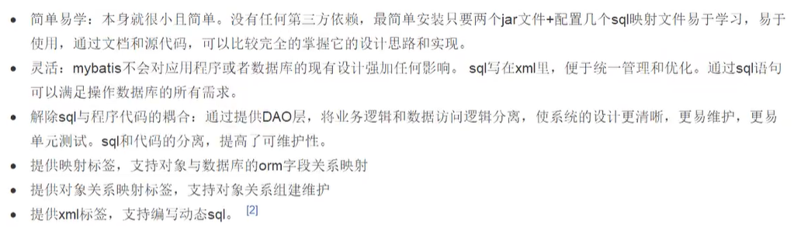

简介

## 什么是Mybatis

是一个优秀的Java的持久层框架，以前也叫 ibatis

支持定制SQL、存储过程以及高级映射等

几乎避免了所有的JDBC代码和手动设置参数以及获取结果集

## 文档

官方中文文档：https://mybatis.org/mybatis-3/zh/index.html

## 持久化

数据持久化：

- 持久化就是将程序的数据在持久状态和瞬时状态转化的过程
- 内存：断电即失
- 数据库（jdbc），io文件持久化
- 生活中：冷藏等

为什么需要持久化？

- 有一些对象我们不能让他们丢失，需要保存下来
- 内存资源昂贵

## 持久层

Dao层、Service层、Controller层

- 完成持久化工作的代码块
- 层界限十分明显

## 为什么需要mybatis

- 帮助程序员将数据存入到数据库中

- 方便
- 传统的JDBC代码太复杂。有人想偷懒，所以想简化。框架
- 不用Mybatis也可以。但是使用Mybatis后开发更方便。技术没有高低之分

优点：去查，看它自己吹。。。

最重要的一点：使用的人多！从众吧

# 第一个 Mybatis 程序

搭建环境 --- 导入Mybatis --- 编写代码 --- 测试

## 搭建环境

搭建数据库，创建表之类的

