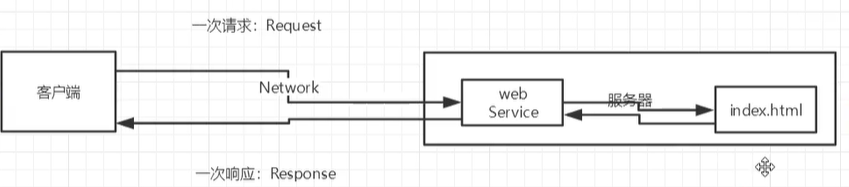
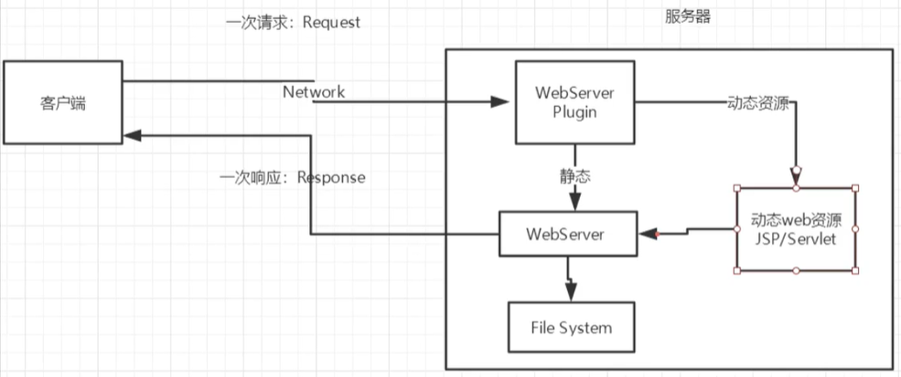
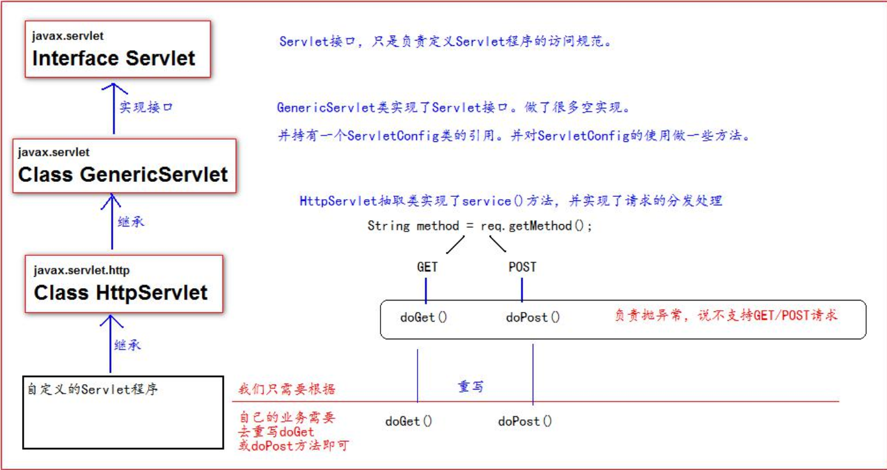
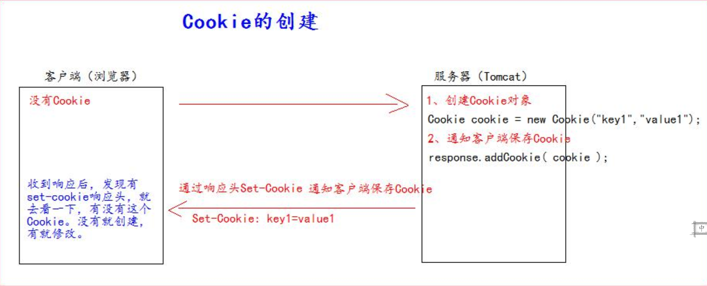
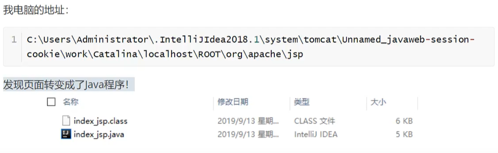
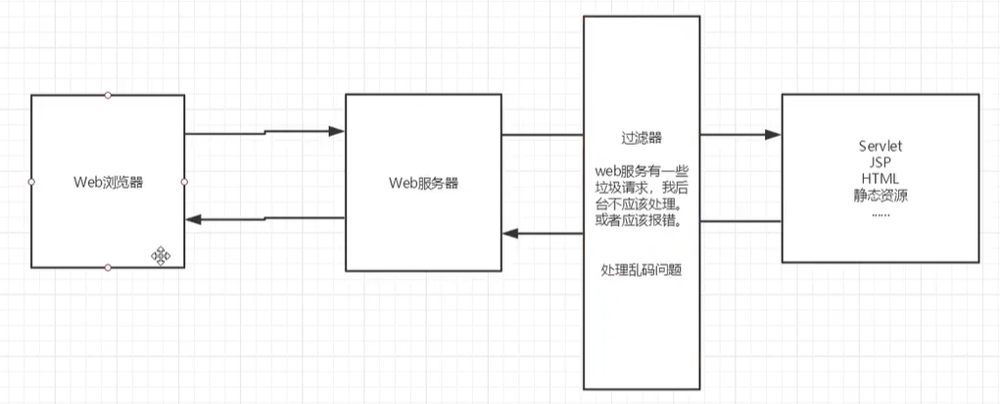
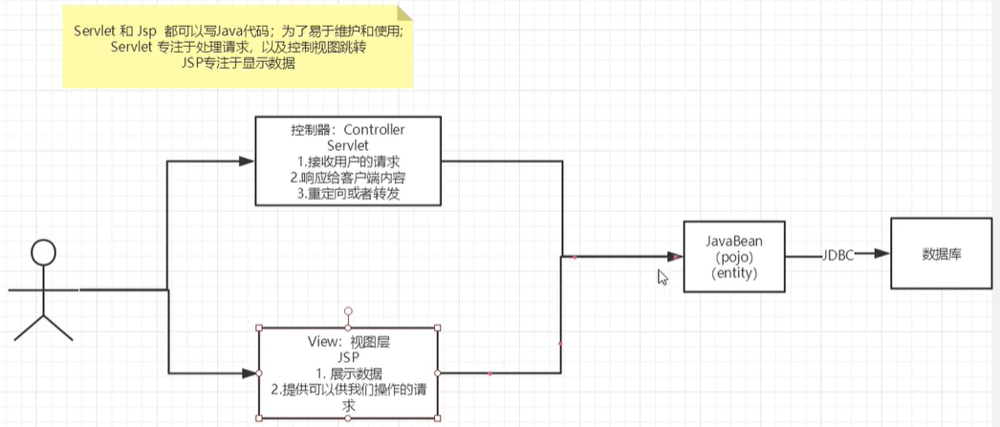
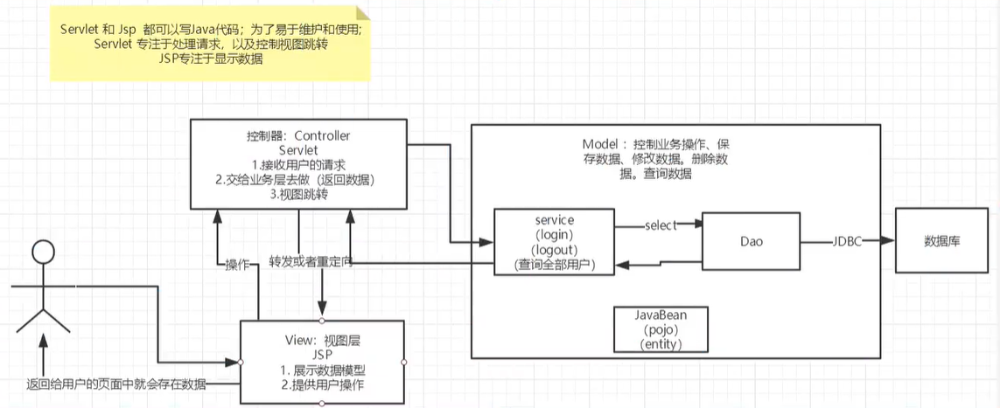
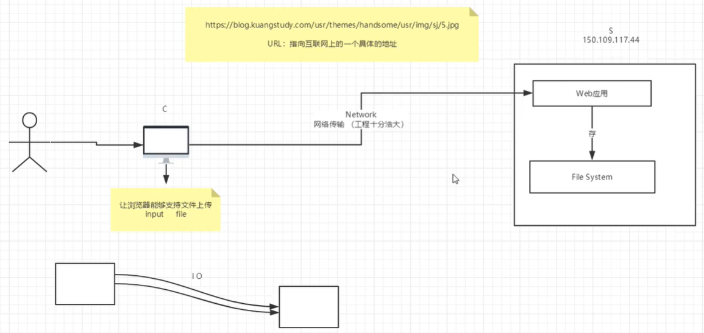

# Web 的概念

Web开发：
- web，网页的意思
- 静态web
  - html、css
  - 提供给所有人看的数据不会动态变化
- 动态web
  - 提供给所有人看的数据会发生变化
  - 页面可以通过请求服务器动态的显示数据
  - 技术栈：Servlet/JSP、ASP、


在Java中，动态web资源开发的技术统称为JavaWeb

Web应用程序：可以提供浏览器访问的程序
- 可以被外界访问，对外界提供服务
- 一个Web应用由多部分组成：
  - html、css、js
  - jsp、servlet
  - java程序
  - jar包
  - 配置文件


Web应用程序编写完毕后，若想提供给外界访问，需要一个服务器来统一管理；



静态web存在的缺点：
- web页面无法动态更新，所有用户看到的都是同一个页面

动态web的显示因人而异：



# 什么是Servlet？

Servlet是JavaEE规范之一

JavaWeb三大组件：Servlet、Filter、Listener

Servlet：接收客户端发送过来的请求，并响应数据给客户端

# 实现一个Servlet

1. 编写一个类，实现Servlet接口
2. 实现service方法，处理数据，响应数据
3. 在web.xml中配置编写好的Servlet的访问路径

# Servlet 原理

# Servlet的生命周期

# Servlet相关类的继承体系



# ServletConfig 类

Servlet 程序的配置信息类

Servlet 程序 和 ServletConfig对象都由Tomcat创建，我们负责使用

Servlet 程序默认第一次访问的时候创建，ServletConfig是每个Servlet程序创建时创建


作用：

- 可以获取Servlet程序的别名 servlet-name 值

  - `config.getServletName()`

- 可以获取初始化参数 init-param

  - ```xml
    <!-- 初始化参数的配置 -->
    <servlet>
    	<servlet-name></servlet-name>
        <servle-class></servle-class>
        <init-param>
        	<param-name>name</param-name>
            <param-value>value</param-value>
        </init-param>
    </servlet>
    ```

  - `config.getInitParameter('xxx')`

- 获取 ServletContext 对象

  - `config.getServletContext()`


注意：

- 重写init方法时，一定要注意要调用父类的 `super.init(servletConfig)`

# ServletContext 类

是一个接口，表示 Servlet 上下文对象

一个 web 工程，只有一个ServletContext 对象实例

ServletContext 对象是一个域对象

ServletContext 对象在web工程部署时自动创建，在web项目停止时销毁


什么是域对象：可以像Map一样存取数据

- 存数据：`context.setAttribute("name", "value")`
- 取数据：`context.getAttribuve("name")`
- 删除：`context.removeAttribute("name")`


ServletContext 类的作用：

- 获取 `web.xml` 中配置的上下文参数 context-param
  - `context.getInitParameter()`
- 获取当前项目的工程路径
  - `context.getContextPath()`
- 获取工程部署后在服务器硬盘上的绝对路径
  - `context.getRealPath("/")`
- 像Map一样存取数据（域对象）


# HttpServletRequest 类

封装了请求的信息

常用方法：

- `getRequestURI()`：获取请求的资源路径
- `getRequestURL()`：获取请求的统一资源定位符（绝对路径）
- `getRemoteHost()`：获取客户端的ip地址
- `getHeader()`：获取请求头
- `getParameter()`：获取请求参数
- `getParameterValues()`：获取请求的参数（有多个值的时候使用）
- `getMethod()`：获取请求的方式
- `setAttribute()`：设置域数据
- `getAttribute()`：获取域数据
- `getRequestDispatcher()`：获取请求转发对象


## doGet 请求的中文乱码解决

```java
String username = req.getParameters("username");

// 先编码后解码
username = new String(username.getBytes("xxx"), "UTF-8")
```

## doPost 请求的中文乱码

```java
// 设置请求体的字符集为UTF-8
req.setCharacterEncoding("UTF-8");
```


# HttpServletResponse  类

封装了响应的信息


## 两个输出流

- 字节流：`getOutputStream()` ：常用于下载（传递二进制数据）
- 字符流：`getWriter()` ： 常用语回传字符串

*注意：两个流只能同时使用一个，否则会报错*


## 响应的乱码解决

方案一：

```java
// 设置服务器字符集为 UTF-8
resp.setCharacterEncoding("UTF-8");
// 通过响应头， 设置浏览器也使用 UTF-8 字符集
resp.setHeader("Content-Type", "text/html; charset=UTF-8");
```

方案二：（推荐）

```java
// 它会同时设置服务器和客户端都使用 UTF-8 字符集， 还设置了响应头
// 此方法一定要在获取流对象之前调用才有效
resp.setContentType("text/html; charset=UTF-8");
```


# 请求转发 与 重定向

## 请求转发

概念：服务器接收到请求之后，从一个资源跳转到另一个资源的操作

特点：

- 浏览器的地址栏没有发生变化
- 是一次请求
- 他们可以共享Request域中的数据
- 可以转发到 WEB-INF 目录下
- 不可以访问工程以外的资源


实现：

```java
req.getRequestDispatcher("xxx").forward(req, resp);
```


## 重定向

重定向：服务器告诉来请求的客户端去请求另一个地址

特点：

- 浏览器的地址栏会发生变化
- 是两次请求
- 不共享Request域中的数据
- 不能访问 WEB-INF 下的资源
- 可以访问工程以外的资源


HttpResponse实现重定向：

方案一：

```java
resp.setStatus(302);
resp.setHeader("Location", "重定向地址");
```

方案二：

```java
resp.sendRedirect("重定向地址");
```


# 通过 HttpServletResponse 下载图片

```java
String realPath = this.getServletContext().getRealPath("1.png");
String fileName = realPath.substring(realPath.lastIndexOf("\\") + 1);

// 设置下载文件的响应头
resp.setHeader("Content-Disposition", "attachment;filename="+URLEncoder.encode(fileName, "UTF-8"));

// 获取下载文件的输入流
FileInputStream in = new FileInputStream(realPath);
int len = 0;
byet[] buffer = new byte[1024];

ServletOutputStream out = resp.getOutputStream();
while((len = in.read(buffer)) > 0) {
    out.write(buffer, 0, len);
}

in.close();
out.close();
```

# Response 图形验证码实现

需要生成随机验证码

需要生成图片


如何通过后台让浏览器5秒刷新一次 ：

```java
resp.setHeader("refresh", "3");
```


```java
resp.setHeader("refresh", "3");
// 在内存中创建一张图片
BufferedImage image = new BufferedImage(80, 20, BufferedImage.TYPE_INT_RGB);
// 得到图片
Graphics2D g = (Graphics2D)image.getGraphics(); // 拿到笔
g.setColor(Color.white);
g.fill(0, 0, 80, 20);
// 向图片上写数据
g.setColor(Color.blue);
g.setFont(new Font(null, Font.BLOD, 20));
g.drawString(makeNum(), 0, 20);

// 告诉浏览器，这个请求用图片的方式打开
resp.setContentType("image/png");
// 网站存在缓存，不让浏览器缓存 expires
resp.setDateHeader("expires", -1);
resp.setHeader("Cache-Control", "no-cache");
resp.setHeader("Pragma", "no-cache");

// 把图片写给浏览器
boolean falg = ImageIO.write(image, resp.getOutputStream());
```


生成固定长度的随机数字符串的方法：

```java
private String makeNum() {
    Random random = new Random();
    String num = random.nextInt(9999999) + "";
    
    StringBuffer sb = new StringBuffer();
    for(int i=0; i<7-num.length; i++) {
        sb.append("0");
    }
    
    num = sb.toString() + num;
    
    return num;
}
```


# Cookie 和 Session

**会话**：用户打开一个浏览器，点击了连接，访问了资源等等，这个过程可以称之为会话

**有状态会话**：例如一个同学来过教室，下次再来教室，就会知道这个同学曾经来过

一个网站，怎么证明你来过？

- 服务器端给客户端一个信件，客户端下次访问带上信件就可以了；Cookie
- 服务器登记你来过了，下次来的时候他就知道了；Session


保存会话的两种技术：Cookie 和 Session

**Cookie**：

- 客户端技术（响应、请求）
- 是服务器通知客户端保存键值对的一种技术
- 客户端有了Cookie之后，每次请求都发送给服务器
- 每个Cookie的大小不能超过 *4KB*
- 300个Cookie，浏览器上限
- 一个站点最多存放20个cookie
- cookie：一般会保存在本地的用户目录下的appdata里

**Session**：

- 服务器技术，利用这个技术，可以保存用户会话信息，我们可以把信息或者数据放在Session中！
- 服务器会给每一个用户（浏览器）创建一个Session对象
- 一个Session独占一个浏览器，只要浏览器没有关闭，这个Session就存在


**Session 和 Cookie 的区别**：

- Cookie是把用户的数据写给用户的浏览器，浏览器保存
- Session是把用户的数据写到用户独占的Session中，服务器保存（保存重要的信息，减少服务器资源的浪费）
- Session对象由服务器创建


常见例子，登录一个网站后，关闭网页，再次打开就不需要再次登录了

## Cookie 的操作



```java
Cookie cookie = new Cookie("key", name);

resp.addCookie(cookie); // 将cookie添加到响应里
// 可以添加多个cookie

new Cookie("lastLoginTime", System.currentTimeMillis()+"");

cookie.setMaxAge(); // 设置cookie的有效期

// 从请求中拿到Cookie
Cookiep[] cookies = req.getCookies();
cookie.getName(); // 获得cookie的key
cookie.getValue(); // 获得cookie的valye

// 删除Cookie
// 可以设置生存时间为0
```

## Session 的操作

```java
// 获取Session
HttpSession session = req.getSession();

// 向Session中存东西
session.setAttribute("name", "value");

// 获取Session的id
String sessionId = session.getId();

// 判断Session是不是新创建的
Boolean isNew = session.isNew();

// 手动注销session
session.invalidate();

```


web.xml 中配置Session的默认失效时间

```xml
<session-config>
    <!-- 15分钟后Session失效（以分钟为单位） -->
	<session-timeout>15</session-timeout>
</session-config>
```


# 解决乱码问题

```java
req.setCharacterEncoding("UTF-8");
resp.setCharacterEncoding("UTF-8");
resp.setContentType("text/html;charset=utf-8");
```


# JSP是什么？

Java Server Pages：Java服务器端页面，也和Servlet一样，用于动态Web技术

JSP本质上也是一个Servlet类

最大的特点：

- 像是在写HTML
- 区别：
  - HTML只能提供静态数据
  - JSP中可以嵌入Java代码

# JSP的原理

tomcat中有一个work目录

IDEA使用Tomcat的会在IDEA的tomcat中产生一个work目录

**浏览器向服务器发请求，不论访问什么资源，其实都是在访问Servlet**

JSP 最终也会被转换称为一个Java类

这个类是一个Servlet程序，判断请求，响应等

内置了一些对象：

```java
final javax.servlet.jsp.PageContext pageContext; // 页面上下文
javax.servlet.http.HttpSession session = null; // session
final javax.servlet.ServletContext application; // applicationContext
final javax.servlet.ServletConfig config; // config
javax.servlet.jsp.JspWriter out = null; // out
final java.lang.Object page = this; // page，当前
HttpServletRequest request; // 请求
HttpServletResponse response; // 响应
```

在输出页面之前的代码：

```java
response.setContentType("text/html"); // 设置了响应页面的数据类型
// 。。。初始化上述对象，这些对象在JSP页面中可以直接使用
```

# JSP 的基本语法

JSP表达式：` <%=xxx %> `，xxx可以写java的表达式，用来将程序的输出，输出到客户端

JSP脚本片段：里面可以写java代码

```jsp
<%
	int sum = 0;
	for(int i=0; i<100; i++) {
        sum += i;
    }
	System.out.println(sum);
%>
```

脚本片段的再实现：脚本片段和HTML可以穿插

```jsp
<%
	一些java代码
%>
<p>
    一个HTML的p标签
</p>
<%
	一些java代码
%>

甚至可以用在for循环中：
<%
	for(int i=0; i<100; i++) {
         %> 啦 <%
    }
%>
这样可以再页面显示100个啦
```


引入java类：

```java
<%@ page import="java.util.*" %>
```


# JSP 指令

```jsp
<%@page args ... %>
<%@include file="" %>
```

# JSP 标签

```jsp
<jsp:xxx >
```

## `<jsp:include>`

拼接页面：`<jsp:include page="" />`

与`<%@include file="xx" />`的区别：

- include会将两个页面合二为一，代码作用域可以共享
- 而jsp:include只是拼接页面，本质还是多个页面，页面之间的变量互不影响

# JSP的内置对象

- `pageContext`
- `request`：存东西
- `response`
- `session`：存东西
- `application`：【ServletContext】存东西
- `config`：【ServletConfig】存东西
- `out`
- `page`
- `exception`：需要声明页面为错误页面才可以使用


四个存东西的对象，域对象：

- pageContext：保存的数据只在一个页面中有效
- request：保存的数据只在一次请求中有效，请求转发会携带这个数据
- session：保存的数据会在一次会话中有效，从打开浏览器到关闭浏览器
- application：保存的数据在服务器中有效，从打开服务器，到关闭服务器


从pageContext中取数据，通过寻找的方式来：从底层到高层（作用域）

- page - > request - > session - > application


# EL 表达式

# JSTL 标签库


# Filter 过滤器

用来过滤网站的数据

例如，处理中文乱码，不像在每个Servlet中都写一次怎么办？




说明：

- 过滤器的所有代码，在过滤指定请求时都会执行
- 必须让过滤器继续执行 `chain.doFilter(req, resp)`


过滤器开发步骤：

- 实现 Filter 接口

- 重写 doFilter 方法

- 在 web.xml 中配置过滤器（类似Servlet的配置）

  - ```xml
    <filter>
    	<filter-name></filter-name>
        <filter-class></filter-class>
    </filter>
    <filter-mapping>
    	<filter-name></filter-name>
        <url-pattern></url-pattern>
    </filter-mapping>
    ```


# Listener 监听器

- 实现一个监听器的接口（很多很多）

注册监听器：

```xml
<listener>
	<listener-class>xxx</listener-class>
</listener>
```


# MVC 三层架构

什么是MVC？

Model、View、Controller

最开始的结构：



用户直接访问控制层，控制层就可以直接操作数据库

弊端：程序十分臃肿，不利于维护

Servlet的代码中会存在：处理请求、响应、视图跳转、处理JDBC、处理业务代码、处理逻辑代码等等

**架构：没有什么是加一层解决不了的！如果有，就再加一层！**

MVC三层架构：



- Model
  - 业务处理：业务逻辑（Service）
  - 数据持久层：CRUD（Dao）
- View
  - 展示数据
  - 提供链接等发起Servlet请求
- Controller（Servlet）
  - 接收用户的请求（req请求参数，session信息等）
  - 交给业务层处理对应的信息
  - 控制视图的跳转


# 文件的下载

下载，就是向浏览器输出消息

下载文件：

- 要获取下载文件的路径
- 下载的文件名？
- 想办法让浏览器能够支持我们要下载的东西
- 创建下载文件的输入流
- 创建缓冲区
- 获取OutputStream对象
- 将FileOutputStream流写入到buffer缓冲区
- 使用OutputStream将缓冲区中的数据输出到客户端


# 文件的上传



浏览器上传文件的过程中是以流的形式提交到服务器的

一般采用 apache 的开源工具 `common-fileupload` 这个文件上传组件

`common-fileupload`依赖于 `common-io` 这个包


文件上传注意事项：

1. 为保证服务器安全，上传的文件应该放在外界无法访问的目录下，比如 `WEB-INF`
2. 为了防止文件发生覆盖的情况，要为上传的文件产生一个唯一的扩展名
3. 要限制上传文件的最大值
4. 可以限制上传文件的类型，在接收到上传文件名时，判断后缀名是否合法


需要用到的类：

`ServletFileUpload` 负责处理上传的文件数据，并将表单中每个输入项封装成一个 `FileItem` 对象，在使用ServletFileUpload对象解析请求时需要 DiskFileItemFactory 对象。

所以，我们需要在进行解析工作前构造好 DiskFileItemFactory 对象，通过 ServletFileUpload 对象的构造方法或 setFileItemFactory 方法设置 ServletFileUpload 对象的 fileItemFactory 属性

`FileItem`类：

在html页面input必须有name：`<input type="file" name="filename" />`

表单中如果包含一个文件上传输入项的话，这个表单的 enctype 属性就必须设置为 `multipart/form-data`


