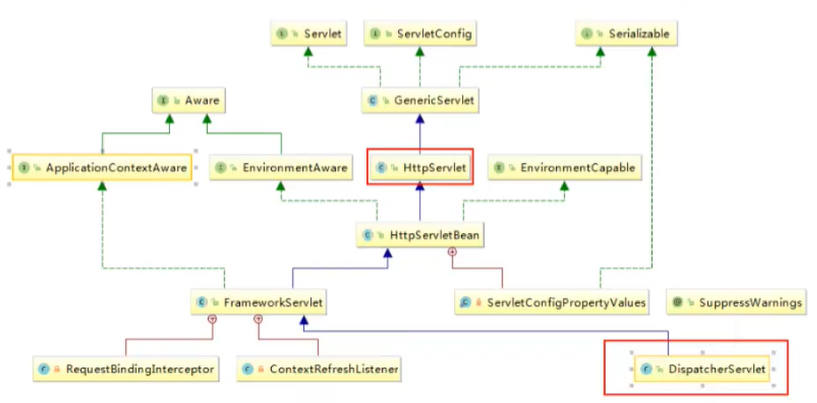
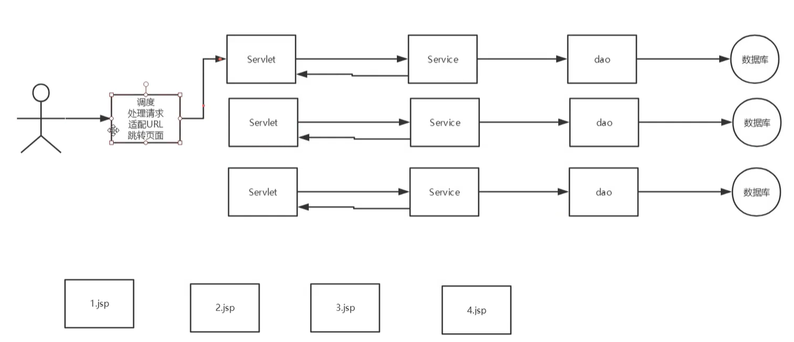
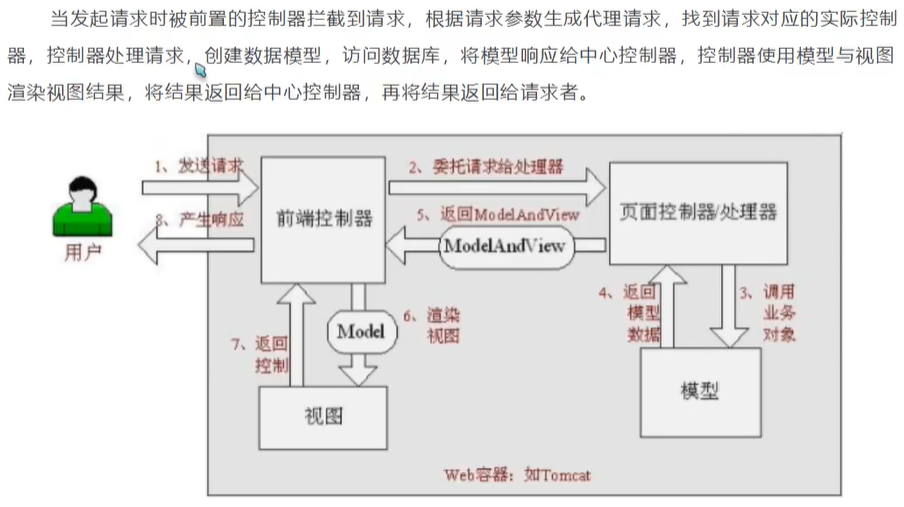

# 简介

## MVC 框架要做哪些事情

1. 将url映射到java类或者java方法
2. 封装用户提交的数据
3. 处理请求---调用相关的业务处理---封装响应数据
4. 将响应的数据进行渲染（jsp、html等表示层数据）

## 什么是 MVC

- MVC是模型（Model）、视图（View）、控制器（Controller）的简写，是一种软件设计规范
- 是将业务逻辑、数据、显示分离的方法来组织代码
- MVC的主要作用是 **降低了视图与业务逻辑间的双向耦合**
- MVC不是一种设计模式，MVC是一种架构模式。当然，不同的MVC之间存在差异

**Model（模型）**：数据模型，提供要展示的数据，因此包含数据和行为，可以认为是领域模型或JavaBean组件（包含数据和行为），不过现在一般都分离开来：Value Object（数据Dao）和服务层（行为Service）。也就是模型提供了模型数据查询和模型数据的状态更新等功能，包括数据和业务。

**View（视图）**：负责进行模型的展示，一般就是我们看到的用户界面，客户想看到的东西。

**Controller（控制器）**：接收用户的请求，委托给模型进行处理（状态改变），处理完毕后把返回的模型数据返回给视图，由视图负责展示。也就是说控制器做了个调度员的工作

最典型的MVC就是：`JSP + Servlet + JavaBean` 的模式

## 什么是 Spring MVC

Spring MVC 是Spring Framework 的一部分，是基于Java实现的MVC的轻量级Web框架

SpringMVC的特点：

- 轻量级，简单易学
- 高效，基于请求响应的MVC框架
- 与Spring兼容性好，无缝结合（Spring 是大杂烩，我们可以将要用到的Bean，注册到Spring中）
- 约定优于配置
- 功能强大：RESTful、数据验证、格式化、本地化、主题等
- 简洁灵活
- 用的人多，用的公司多

**Spring的web框架围绕着 DispatcherServlet （调度Servlet）设计**


## 文档

官方文档推荐看老版本的 `4.3.24`


# 初识 Spring MVC

## DispatcherServlet

Spring的web框架围绕着 `DispatcherServlet` 设计

`DispatcherServlet` 的作用是将请求分发到不同的处理器

Spring MVC 以请求为驱动，围绕着一个中心 Servlet分派请求及提供其他功能，DispatcherServlet 是一个实际的Servlet（继承 HttpServlet）





 

## SpringMVC 的简单原理




# Hello SpringMVC

- 新建一个web项目

- 添加SpringMVC的相关依赖

```xml
        <dependency>
            <groupId>junit</groupId>
            <artifactId>junit</artifactId>
            <version>4.12</version>
        </dependency>

        <dependency>
            <groupId>org.springframework</groupId>
            <artifactId>spring-webmvc</artifactId>
            <version>5.1.9.RELEASE</version>
        </dependency>

        <dependency>
            <groupId>javax.servlet</groupId>
            <artifactId>servlet-api</artifactId>
            <version>2.5</version>
        </dependency>

        <dependency>
            <groupId>javax.servlet.jsp</groupId>
            <artifactId>jsp-api</artifactId>
            <version>2.2</version>
        </dependency>

        <dependency>
            <groupId>javax.servlet</groupId>
            <artifactId>jstl</artifactId>
            <version>1.2</version>
        </dependency>
```

- 配置web.xml，注册 DispatcherServlet

```xml
<!-- 注册DispatcherServlet，MVC的核心，请求分发器 -->
<servlet>
	<servlet-name>springmvc</servlet-name>
    <servlet-class>org.springframework.web.servlet.DispatcherServlet</servlet-class>
    <!-- 关联一个springmvc的配置文件 -->
    <init-param>
    	<param-name>contextConfigLocation</param-name>
        <param-value>classpath:springmvc-servlet.xml</param-value>
    </init-param>
    <!-- 启动级别 1 -->
    <load-on-startup>1</load-on-startup>
</servlet>
<!-- / 匹配所有请求（不包括 .jsp） -->
<!-- /* 匹配所有请求（包括 .jsp） -->
<servlet-mapping>
	<servlet-name>springmvc</servlet-name>
    <url-pattern>/</url-pattern>
</servlet-mapping>
```

- 编写一个 `HelloController` 类

```java
package com.bingyi.controller;

import org.springframework.web.servlet.ModelAndView;
import org.springframework.web.servlet.mvc.Controller;

import javax.servlet.http.HttpServletRequest;
import javax.servlet.http.HttpServletResponse;


/**
 * 实现Controller接口
 * @author bingyi
 */
public class HelloController implements Controller {
    @Override
    public ModelAndView handleRequest(HttpServletRequest httpServletRequest, HttpServletResponse httpServletResponse) throws Exception {
        System.out.println("成功进入！");
        // ModelAndView 模型和视图
        ModelAndView mv = new ModelAndView();
        // 封装对象
        mv.addObject("msg", "HelloSpringMVC");
        // 封装要跳转的视图
        // 会自动加上前缀后缀 /WEB-INF/jsp/hello.jsp
        mv.setViewName("hello");
        return mv;
    }
}
```


- 编写SpringMVC的配置文件：`springmvc-servlet.xml` （spring的bean配置文件）

```xml
<?xml version="1.0" encoding="UTF-8"?>
<beans xmlns="http://www.springframework.org/schema/beans"
       xmlns:xsi="http://www.w3.org/2001/XMLSchema-instance"
       xsi:schemaLocation="http://www.springframework.org/schema/beans http://www.springframework.org/schema/beans/spring-beans.xsd">

    <bean class="org.springframework.web.servlet.handler.BeanNameUrlHandlerMapping" />
    <bean class="org.springframework.web.servlet.mvc.SimpleControllerHandlerAdapter" />

    <!--视图解析器Dispatcher给它的ModelAndView-->
    <bean class="org.springframework.web.servlet.view.InternalResourceViewResolver" id="internalResourceViewResolver">
        <!--前缀-->
        <property name="prefix" value="/WEB-INF/jsp/" />
        <!--后缀-->
        <property name="suffix" value=".jsp" />
    </bean>

    <!--HelloController，用户访问 /hello 请求转到HelloController处理-->
    <bean id="/hello" class="com.bingyi.controller.HelloController"/>

</beans>
```

- 在 `WEB-INF/jsp` 下创建一个 `hello.jsp`

```jsp
<%@ page contentType="text/html;charset=UTF-8" language="java" %>
<html>
<head>
    <title>HelloSpringMVC</title>
</head>
<body>
    ${msg}
</body>
</html>

```

- 启动项目，浏览器访问 `xxx/hello`

# 注解版 HelloWorld

修改上面的 `springmvc-servlet` 配置文件:

```xml

<?xml version="1.0" encoding="UTF-8"?>
<beans xmlns="http://www.springframework.org/schema/beans"
       xmlns:xsi="http://www.w3.org/2001/XMLSchema-instance"
       xmlns:context="http://www.springframework.org/schema/context"
       xmlns:mvc="http://www.springframework.org/schema/mvc"
       xsi:schemaLocation="http://www.springframework.org/schema/beans http://www.springframework.org/schema/beans/spring-beans.xsd http://www.springframework.org/schema/context https://www.springframework.org/schema/context/spring-context.xsd http://www.springframework.org/schema/mvc https://www.springframework.org/schema/mvc/spring-mvc.xsd">

    <!--配置包注解扫描-->
    <context:component-scan base-package="com.bingyi.controller" />
    <mvc:default-servlet-handler />
    <mvc:annotation-driven />

    <bean class="org.springframework.web.servlet.view.InternalResourceViewResolver" id="internalResourceViewResolver">
        <!--前缀-->
        <property name="prefix" value="/WEB-INF/jsp/" />
        <!--后缀-->
        <property name="suffix" value=".jsp" />
    </bean>

</beans>
```

修改 HelloController 的代码：

```java
package com.bingyi.controller;


import org.springframework.stereotype.Controller;
import org.springframework.ui.Model;
import org.springframework.web.bind.annotation.GetMapping;
import org.springframework.web.bind.annotation.RequestMapping;

@Controller
public class HelloController {

    @RequestMapping("/hello")
    public String hello(Model model) {

        model.addAttribute("msg", "这是注解版的SpringNVC HelloWorld");

        return "hello";
    }
}
```

其他的东西不需要动，访问结果和使用xml配置Controller一样

# Controller

- 控制器复杂提供访问应用程序的行为，通常通过接口定义或注解定义两种方式实现
- 控制器负责解析用户的请求并将其转换为一个模型
- 在SpringMVC中一个控制器可以包含多个方法
- 在SpringMVC中，对于Controller的配置方式有很多种


在Controller的请求处理方法里面，也可以使用Servelt的API方法


# @RequestMapping

这个注解设定了请求处理方法对应的请求 URL，以及相应的请求方式

默认值就是请求路径，method参数可以指定请求的方式

# RESTfule 风格

**概念**：Restful就是一个资源定位及资源操作的风格。不是标准也不是协议，只是一种风格。基于这种风格设计的软件可以更简洁，更有层次，更易于实现缓存等机制

**功能**：

- 资源：互联网的所有事物都可以被抽象为资源
- 资源操作：使用不同方法对资源进行操作
- 分别对应，添加，修改，删除，查询

# @RequestParam 请求参数

# @PathVariable 路径变量

可以接受请求地址里定义的变量

例如：`xxx/{a}/{b}`，这里面的a、b之类的就可以用这个注解标注参数接收


# 重定向和转发

在return的时候指定（使用前要把视图解析器关掉）

- 请求转发：`return "forward:/xxx.jsp"`
- 重定向：`return "redirect:/xxx.jsp"`


# ResponseBody

加了这个注解，处理方法的返回就不会走视图解析器，而是直接返回返回的内容


